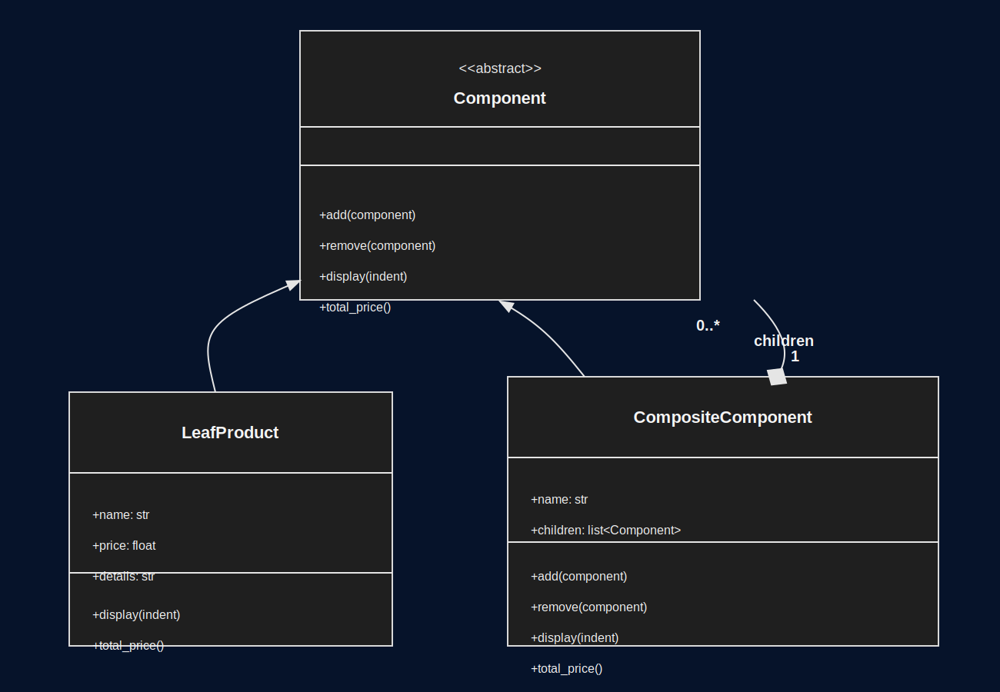

# Ensamblador de PC con Patron Composite


Proyecto en Python que aplica el patron **Composite** para armar una configuracion de PC por gama (`alta`, `media`, `baja`) y calcular el costo total.

## Objetivo del proyecto

- Modelar una PC como un arbol de objetos (nodos compuestos + nodos hoja).
- Guiar al usuario desde CLI para elegir componentes en orden fijo.
- Mostrar un resumen final con estructura del arbol y precio total.

## Arquitectura general

- `main.py`: punto de entrada; agrega `src/` al `sys.path` y ejecuta `run_cli()`.
- `src/pc_builder/composite.py`: implementacion del patron Composite.
- `src/pc_builder/catalog.py`: datos del catalogo y reglas de prioridad.
- `src/pc_builder/cli.py`: flujo interactivo de seleccion y armado.
- `tests/`: pruebas de comportamiento del Composite y del flujo.

## Patron Composite en este proyecto

El patron **Composite** permite representar una estructura jerarquica de objetos como si fuera un arbol, donde se puede tratar de forma uniforme a objetos individuales y a conjuntos de objetos.

En este proyecto:
- Un componente individual (producto) se modela como `LeafProduct`.
- Un agrupador (categoria o configuracion completa) se modela como `CompositeComponent`.
- Ambos comparten la interfaz `Component`, por eso se operan igual con metodos como `display()` y `total_price()`.

Beneficio practico:
- El calculo del costo total no depende de condicionales por tipo, porque cada nodo sabe resolver su parte y los compuestos delegan recursivamente en sus hijos.

## Clases mas importantes

### `Component` (`src/pc_builder/composite.py`)

Interfaz base del patron.

Responsabilidad principal:
- Define contrato comun para todos los nodos: `add`, `remove`, `display`, `total_price`.

Por que es importante:
- Permite tratar de la misma forma hojas y compuestos.
- Hace posible recorrer y calcular el arbol sin conocer tipos concretos.

### `LeafProduct` (`src/pc_builder/composite.py`)

Nodo hoja que representa un producto seleccionable.

Responsabilidad principal:
- Guardar `name`, `price`, `details`.
- Mostrar su propia linea de salida con `display()`.
- Retornar su costo individual en `total_price()`.

Por que es importante:
- Es la unidad minima de valor economico del sistema.
- No tiene hijos; su comportamiento es simple y directo.

### `CompositeComponent` (`src/pc_builder/composite.py`)

Nodo compuesto que agrupa otros nodos (`Component`).

Responsabilidad principal:
- Mantener `children`.
- Agregar/quitar nodos con `add()` y `remove()`.
- Construir representacion jerarquica con `display(indent)`.
- Sumar costos de todos sus hijos con `total_price()`.

Por que es importante:
- Permite modelar categorias (ej. CPU, RAM) y la configuracion completa.
- Materializa la ventaja central del patron Composite: composicion recursiva.

## Diagrama UML (patron Composite)

Vista general de las clases y sus relaciones:



### Explicacion sencilla

- `Component` es la base comun: define los metodos que todos usan.
- `LeafProduct` es una hoja: representa un producto individual con precio.
- `CompositeComponent` es un contenedor: guarda varios componentes y suma sus precios de forma recursiva.

## Ejecucion


## Modulos clave y su logica

### `catalog.py`

Contiene las reglas y datos base del armado:
- `BUILD_PRIORITY`: orden exacto de seleccion de componentes.
- `COMPONENT_LABELS`: nombre legible de cada categoria.
- `BRANCH_LABELS`: etiqueta visible para cada gama.
- `CATALOG`: opciones por gama, categoria, nombre, precio y detalle.

Importancia:
- Separa datos de negocio del flujo de interfaz.
- Facilita mantenimiento (actualizar precios/modelos sin tocar la logica).

### `cli.py`

Orquesta toda la interaccion con el usuario:
- `prompt_branch(...)`: valida eleccion de gama.
- `prompt_component_choice(...)`: muestra 2 opciones y valida entrada.
- `build_pc(...)`: construye el arbol (`CompositeComponent`) segun la prioridad.
- `format_summary(...)`: genera salida final con estructura y total.
- `run_cli(...)`: punto de coordinacion de la experiencia CLI.

Importancia:
- Centraliza reglas de entrada/salida.
- Convierte datos del catalogo en objetos del modelo Composite.

## Flujo completo de ejecucion

1. `main.py` invoca `run_cli()`.
2. `run_cli()` pide gama con `prompt_branch()`.
3. `build_pc()` recorre `BUILD_PRIORITY`.
4. En cada categoria, el usuario elige una opcion del `CATALOG`.
5. Se crea un `LeafProduct` y se agrega a un `CompositeComponent` de categoria.
6. Todas las categorias se agregan al arbol raiz de configuracion.
7. `format_summary()` imprime arbol + total (`total_price()`).


## Conclusion personal

En este proyecto yo compruebo que el patron Composite me ayuda a pensar la configuracion de una PC como una estructura natural de arbol, en lugar de manejar listas y condicionales dispersos. En mi experiencia, esta decision simplifica el mantenimiento, porque puedo agregar categorias o productos sin romper la logica principal. Tambien me permite reutilizar metodos como `display()` y `total_price()` de forma consistente, haciendo que el codigo sea mas claro, extensible y facil de probar.

## Ejecutar

```powershell
python .\main.py
```

## Probar

```powershell
python -m unittest discover -s .\tests -p "test_*.py"
```
